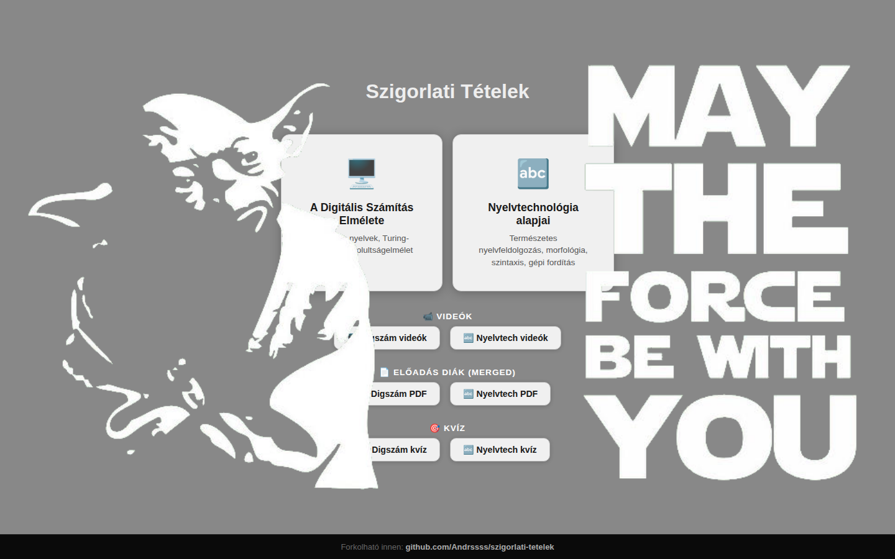
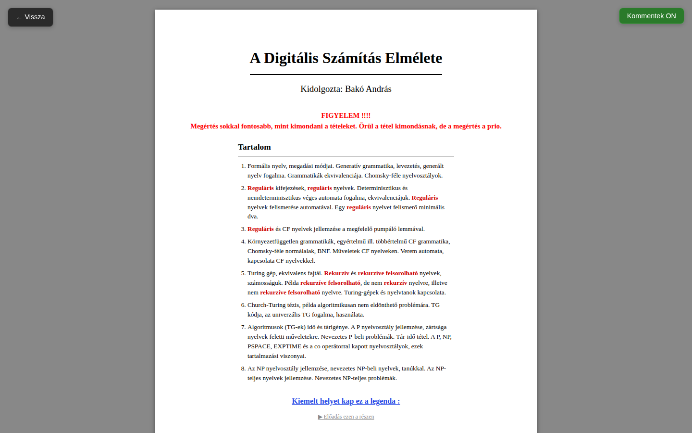
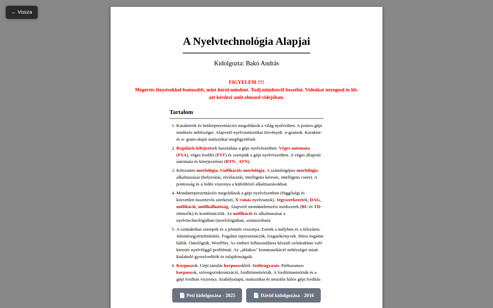
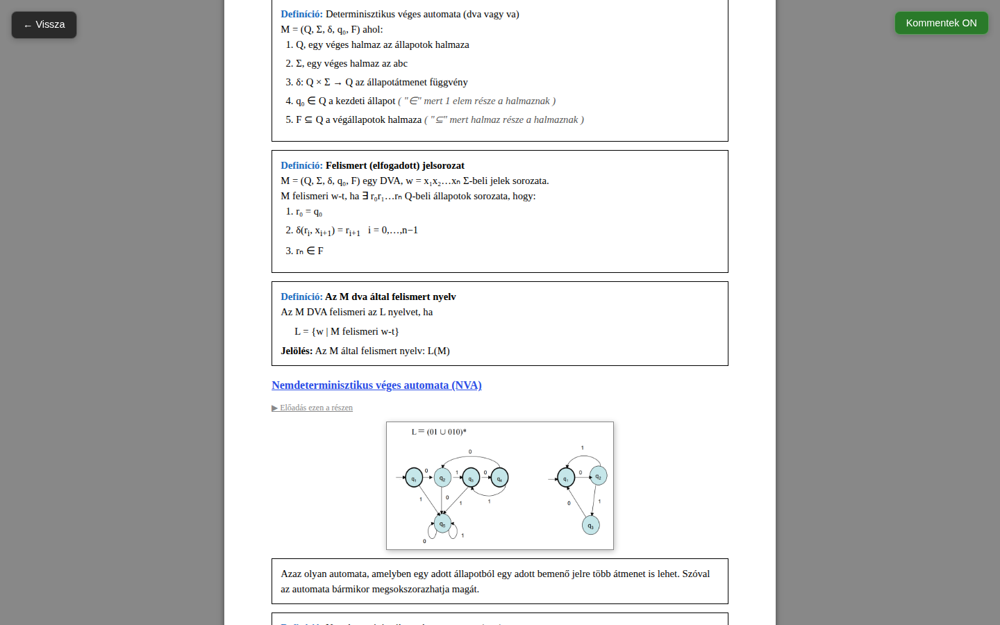
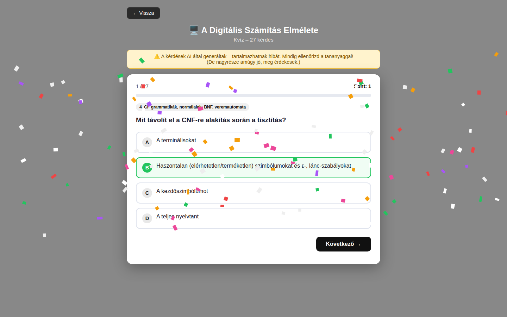

# Szigorlati Tételek

Kidolgozott szigorlati tételek két tárgyból, egy helyen: tételsorok, előadásvideók, diák és gyakorló kvíz.



## Tárgyak

| | Tárgy | Témák |
|---|---|---|
| 🖥️ | **A Digitális Számítás Elmélete** | Formális nyelvek, véges automaták, CF grammatikák, Turing-gépek, bonyolultságelmélet (P, NP, PSPACE) |
| 🔤 | **Nyelvtechnológia alapjai** | Karakterkódolás, reguláris kifejezések és véges automaták, morfológia, szintaxis, szemantika, korpuszok, gépi fordítás |

## Tételkidolgozások

Minden tárgyhoz tartozik egy nyomtatható kidolgozás, tartalomjegyzékkel és a tételek kiemelt kulcsfogalmaival.

<p>
  
  
</p>

A tételekben keretezett definíciók és tételek, ábrák, valamint a megfelelő előadásrészre mutató linkek vannak. A jobb felső **Kommentek ON/OFF** gombbal a saját megjegyzések el is rejthetők.



## Kvíz

Tárgyanként feleletválasztós kvíz a tételek anyagából, pontszámmal és haladásjelzővel.



> ⚠️ A kvízkérdéseket AI generálta – tartalmazhatnak hibát, mindig érdemes a tananyaggal ellenőrizni.

## Egyéb anyagok

- 📹 **Előadásvideók** – YouTube lejátszási listák mindkét tárgyhoz ([Digszám](https://www.youtube.com/playlist?list=PLvLI66ieiidjpdd-yGGrjAHYG24L4HiYY), [Nyelvtech](https://www.youtube.com/playlist?list=PLvLI66ieiidhOULovlk35bwn9Dz6LGVFC))
- 📄 **Előadásdiák** – összefűzött PDF-ek a [`pdf/`](pdf) mappában
- 📝 **Videóátiratok** – az előadásvideók szövege a [`video_szovegek/`](video_szovegek) mappában
- Két korábbi hallgatói kidolgozás a Nyelvtechnológiához (Peti – 2025, Dávid – 2016)

## Felépítés

```
index.html                              főoldal
szamitaselmeleti-tetelek-print.html     Digitális Számítás Elmélete tételek
nyelvtechnologiai-tetelek-print.html    Nyelvtechnológia tételek
quiz.html + quiz-questions.js           kvíz
shared.css / shared.js                  közös stílus és viselkedés
img/                                    ábrák a tételekhez
pdf/                                    előadásdiák, kidolgozások
video_szovegek/                         videóátiratok
```

Tiszta HTML/CSS/JS, nincs build lépés vagy függőség.

## Látogatásnaplózás

Az oldalak megnyitását a `track.js` küldi a Netlify `visit` function-nek, ami [Netlify Blobs](https://docs.netlify.com/blobs/overview/)-ba menti (`visits` store, látogatásonként egy JSON: időpont, oldal, anonim böngészőazonosító, referrer, képernyőméret, nyelv, user agent; IP-t nem tárolunk). Kiolvasás: `/.netlify/functions/stats?key=<STATS_KEY>` – a `STATS_KEY` a Netlify környezeti változói között állítandó be.
